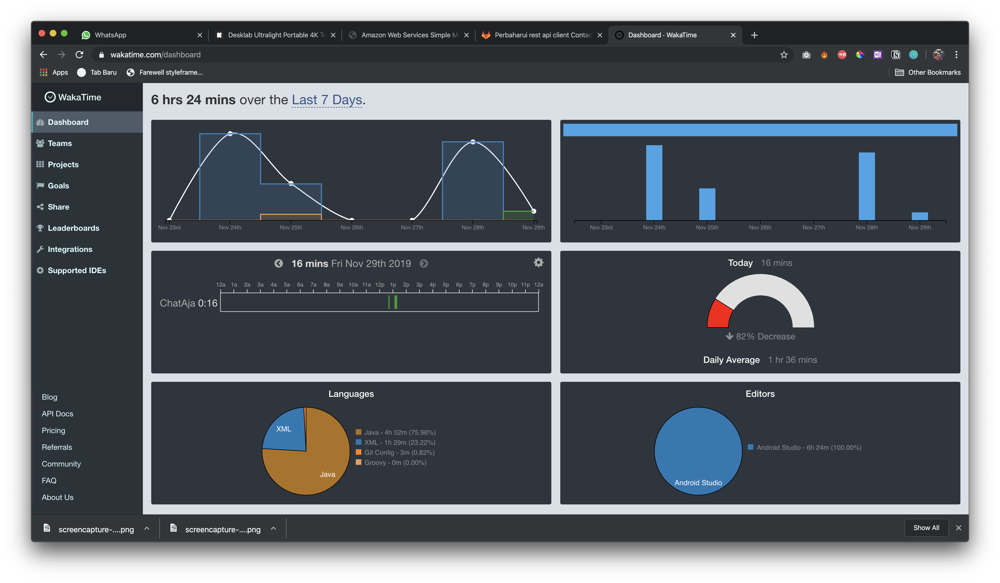

Sudah hampir dua minggu ini aku mengerjakan side project. Akhirnya setelah sekian lama ingin memiliki side project, baru bisa tereksekusi sekarang. Ada beberapa faktor yang membuat aku bisa memulai termotivasi mengerjakan side project ini.
<!-- end -->

Hampir setahun belakang ini aku selalu mencatat ide-ide yang muncul. Yang rencananya dikerjakan, tapi akhirnya ide-ide tersebut cuma jadi list yang tidak pernah tersentuh.

Tapi 2 minggu terakhir aku sangat termotivasi untuk mengeksekusi salah satu dari list ide yang ada, dan menurutku ini bisa jadi referensi bagian kalian yang mempunyai kerjaan atau *goal* tapi tidak pernah bisa memulainya karena tidak ada motivasi.

Aku habis baca buku **Motivational Hacker** yang secara gari besar menceritakan bagaimana dia bisa termotivasi melakukan *goals* dia yang dengan waktu kita yang terbatas. Dia menciptakan persamaan motivasi yakni sbb:

> Motivation = (Expectation x Value) / (Impulsivness x Delay)

1. **Expectation**: Keyakinan keberhasilan dari kerjaan atau kegiatan untuk mencapai *goals*.

2. **Value**: Seberapa besar *reward* dari *goals* ketika tercapai & seberapa menyenangkannya ketika kamu melakukan kerjaan/kegiatan tersebut.

3. **Impulsivness**: Seberapa besar distraksi yang akan terjadi ketika  mengerjakan kerjaan/kegiatan tersebut.

4. **Delay**: Berapa lama kamu harus melakukan kegiatan tersebut hingga mencapai *goals*-nya.

Jadi semakin besar **Expectation & Value** dan semakin kecil **Impulsivness & Delay** maka motivasi kita akan semakin tinggi.

Contohnya misal kita ingin memliki tubuh yang ideal, untuk mencapai tubuh yang ideal kita ingin mencapainya dengan nge-gym.

Kita mulai dari **Expectation**. Seberapa besar keyakinan untuk mencapai tubuh ideal dengan nge-gym. Keyakinan kita bisa berasal dari teman atau saudara yang rutin nge-gym & terbukti memiliki badan yang ideal.

**Value**-nya. Bisa kita nilai dari seberapa besar keuntungan dari memiliki *tubuh yang ideal* ini. Mungkin dengan memiliki tubuh ideal kita percaya kita akan merasa lebih percaya diri bertemu dengan orang baru, atau dengan memiliki tubuh yang ideal kita percaya bisa mendapatkan *privilege* di lingkungan sosial. Selain itu sebarapa *fun* nanti kita akan nge-gym mungkin kita bisa nge-gym bareng teman.

**Impulsiveness**. Distraksi mungkin bisa dari tempat gym-nya terlalu jauh, atau kerjaan kantor yang padat. Atau mungkin kita punya mainan/console game baru yang membuat kita mengabaikan gym.

**Delay**-nya yakni, kita melihat teman kita seberapa lama dia rutin nge-gym hingga mendapatkan body yang ideal.

Berdasarkan contoh tersebut, konteks dari **Expectation, Value dan Delay** memiliki kesamaan, yakni parameter tersebut berdasarkan atas `experience dari orang lain`. Dimana hal itu bisa kita dapatkan dari komunitas.

Dalam kasusku, aku ingin memiliki side project agar memiliki penghasilan tambahan. Aku menemukan [**IndiHackers**](https://indiehackers.com), forum komunitas indie developer. Disana para developer saling bercerita mengenai pengalaman mereka mengenai *idea-validation*, *milestone*, serta teknik-teknik mendapatkan user. Dari sini aku mendapatkan **Expectation, Value dan Delay**.

Selain itu untuk meningkatkan **Value** aku juga menggunakan [**Trello**](https://trello.com) sebagai task management. Mengetahui aktifitas *keep-on-track* dan mengetahui task-task yang sudah *done* dan jadi lega banget.

Aku juga menggunakan [**WakaTime**](https://wakatime.com) untuk me-*record* *coding time*, karena entah mengapa sangat memuaskan melihat grafik-grafik analytics dari produktifitasku. Hal Ini membuat pengerjaan *side project* serasa menyenangkan.

Sebenarnya peran terbesar dari motivasiku ini adalah [**IndiHackers**](https://indiehackers.com). Melihat orang-orang yang sudah berhasil menghasilkan ribuan dollar perhari hanya dengan (sounds familiar? lol) product-product yang tepat sasaran, yang tidak menggunakan teknologi-teknologi yang susah dan mudah dibuat sangat meningkatkan **Expectation** dan menurunkan **Delay**.

Jadi kapan aku mengerjakan side project ini? aku mengerjakannya sehabis pulang kantor. Biasanya 1-2 jam sebelum tidur. Aku berusaha menyentuhnya tiap hari, walaupun progressnya kecil agar kebiasaanku mulai terbentuk.

Jadi buat kalian yang memiliki goal tapi tidak memiliki motivasi untuk mencapainya, saranku adalah:

1. Cari komunitas atau teman yang memiliki goals yang sama
2. *Start small*, mulai dari hal kecil.
3. Track your progress.

Terimakasih sudah membaca, semoga bermanfaat. 